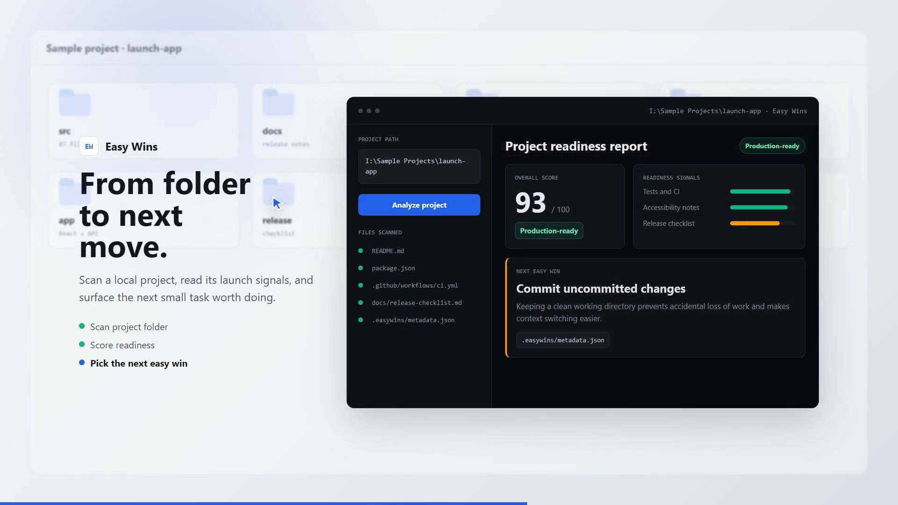

<p align="center">
  
</p>

# Easy Wins Project Tracker

<p align="center">
  <strong>Know what to work on next.</strong>
</p>

<p align="center">
  Local-first project analysis for builders who want practical readiness checks, clear risk signals, and one small useful task to do next.
</p>

<p align="center">
  <a href="https://github.com/reiiigns/project-tracker/actions/workflows/ci.yml"></a>
  
  
  
  
</p>

Easy Wins scans a local project folder, reads its code and docs, and returns a practical dashboard for project stage, readiness, risks, and the next small task worth doing. It is built for local projects where the next useful move matters more than another planning board.

## What It Does

- Scans project structure, docs, package files, TODOs, git status, source counts, tests, CI, Docker, and release signals.
- Scores core functionality, UI polish, code quality, stability, performance, documentation, and deployment readiness.
- Generates high-impact, quick tasks with file-level starting points so the next step is specific, not motivational.
- Supports analysis profiles for web, desktop, mobile, server/API, CLI, games, accessibility, and publishing targets.
- Writes local `.easywins/` metadata so humans and agents can pick up the same project context later.
- Runs as a Vite + React dashboard with an Express API, plus optional Electron packaging.

## Product Preview

<p align="center">
  
</p>

The launch story is simple: choose a project folder, scan it, review readiness, then start with the next focused win.

<p align="center">
  <a href="app/public/site/easywins_video_mockup.mp4">
    
  </a>
</p>

## Current Readiness

| Area | Status |
| --- | --- |
| App stage | Production-ready local tool |
| Tests | Node test runner suite in `app/tests/` |
| Build | Vite client build and TypeScript server build |
| Accessibility | WCAG 2.2 AA pass documented in `app/docs/accessibility.md` |
| Release | GitHub release checklist documented in `app/docs/release-checklist.md` |
| CI | GitHub Actions workflow at `.github/workflows/ci.yml` |

## Quick Start

```bash
cd app
npm ci
npm run dev
```

Open [http://localhost:3000/site](http://localhost:3000/site).

The API runs on [http://localhost:3001](http://localhost:3001), and the Vite dev server proxies `/api` requests to it.

## Analyzer Modes

| Mode | Use when |
| --- | --- |
| Heuristics | You want a fast, no-key baseline analysis. |
| Local llama.cpp | You want offline AI analysis with a local GGUF model. |
| OpenAI | You want cloud fallback analysis with an OpenAI API key. |

Configuration lives in `app/.env.example`.

## Validation

Run these from `app/` before shipping changes:

```bash
npm run typecheck
npm test
npm run build
```

For desktop artifacts:

```bash
npm run electron:build
```

The GitHub workflow runs install, lint, typecheck, build, tests, and Docker build from the app workspace.

## Repository Layout

```text
.
|-- .github/workflows/ci.yml       # GitHub Actions checks
|-- app/                           # Product source
|   |-- public/                    # Logo and launch media
|   |-- src/                       # React dashboard and launch page
|   |-- server/                    # Express API and analyzer
|   |-- electron/                  # Desktop shell
|   |-- tests/                     # Node test runner tests
|   |-- docs/                      # Accessibility and release notes
|   `-- package.json
|-- AGENTS.md                      # Agent workflow guidance
`-- README.md                      # GitHub overview
```

## Release Notes

Before publishing a GitHub release, update `app/package.json`, add notes to `app/CHANGELOG.md`, run validation, build desktop artifacts when needed, and attach installers/checksums from `app/release/`. The full checklist is in [app/docs/release-checklist.md](app/docs/release-checklist.md).

## License

MIT
