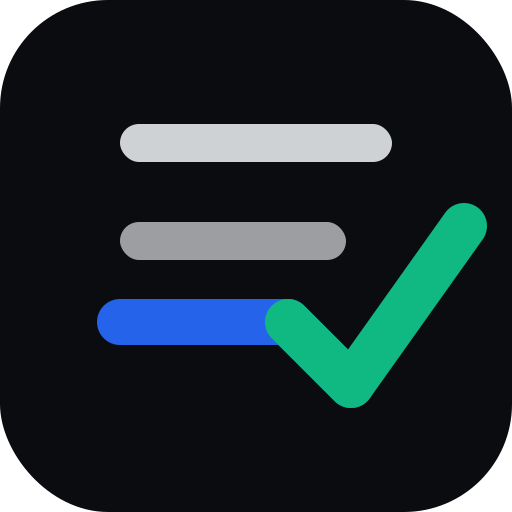
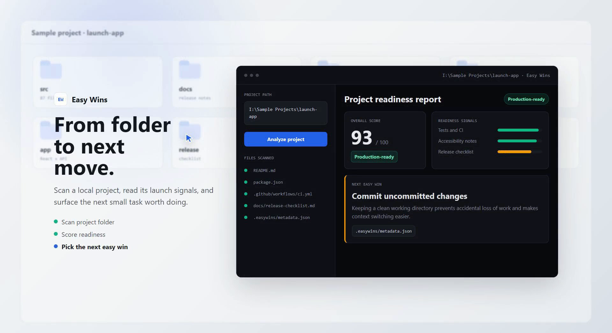

  

  <h1>Easy Wins</h1>

  
<strong>Know what to work on next.</strong>

  

    
    &nbsp;
    
    &nbsp;
    
  

---

Easy Wins scans a local project folder and returns a practical dashboard for project stage, readiness, risks, and the next small task worth doing.

It reads project structure, docs, package files, TODOs, git status, source counts, tests, CI, Docker, and release signals — then turns that context into focused recommendations you can act on today.

  

## What it does

- **Scans everything** — project structure, docs, packages, TODOs, git status, tests, CI, Docker, and release signals
- **Scores readiness** — core functionality, UI polish, code quality, stability, performance, documentation, and deployment
- **Builds a today plan** — specific next tasks with file-level starting points
- **Supports any project type** — web, desktop, mobile, server/API, CLI, games, accessibility, publishing profiles
- **Works offline by default** — built-in heuristics analysis, no API key required
- **Writes agent context** — saves `.easywins/` metadata so humans and agents can pick up from the same state

## Get it

→ **[Buy Easy Wins on Lemon Squeezy](https://easy-wins.lemonsqueezy.com)**

Windows x64 desktop app. No internet connection required for the default analysis mode.

## Requirements

- Windows 11 x64 (Windows 10 x64 supported)
- A local project folder to analyze
- No internet connection required for heuristics mode
- Optional: OpenAI API key or local llama.cpp for AI-assisted analysis

---

  © 2026 Easy Wins. All rights reserved.

